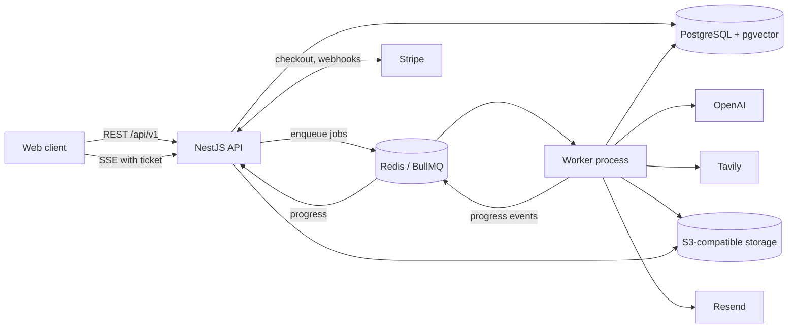

# TalentPilot API

NestJS backend for TalentPilot, an AI-assisted ATS resume optimizer and job-application prep tool.

## Overview

Applicants rarely know why a resume is filtered out or how to tailor it to a role without inventing experience. This API parses a resume and a job description, scores the match, and proposes edits that are checked against the resume so they don't introduce unsupported claims. For the same role it can also generate a cover letter, interview questions, a learning roadmap, company research and a salary estimate. Long-running AI work runs in background workers, and usage is metered through credits and Stripe subscriptions.

## Screenshots

<table>
  <tr>
    <td><br><sub>ATS report: overall score, weighted score breakdown and keyword coverage</sub></td>
    <td><br><sub>Interview prep: questions grounded in the resume, with answer feedback</sub></td>
  </tr>
</table>

More screenshots are in the web client repository: https://github.com/njkr/talentpilot-fe

## Key features

- Email/password auth with OTP email verification, password reset, short-lived JWT access tokens, rotating httpOnly refresh cookies, and per-device session listing/revocation.
- Resume upload (PDF/DOCX), text extraction, AI parsing into structured sections, section editing, and immutable resume versions with diff and forward-only restore.
- Job descriptions by paste or upload, parsed into requirements, skills and keywords.
- ATS scoring: keyword matching (with skill aliases and AI keyword-equivalence), semantic scoring from pgvector embeddings, and format checks. Includes match band, before/after scores and a paid re-score.
- Optimization suggestions with a fabrication guard. Unverifiable suggestions are returned as "needs info" rather than applied.
- A multi-step analysis pipeline (workspace = resume + job description) run by BullMQ workers, with live progress over Server-Sent Events and a polling endpoint.
- Cover letter, interview questions with answer feedback, company insight (Tavily web search), salary estimate and a learning roadmap with admin-configurable affiliate links.
- PDF and DOCX document generation (Puppeteer, docx) stored in S3-compatible storage with signed download URLs.
- Credits ledger, Stripe subscriptions (checkout, portal, cancel, switch plan), credit packs, referrals and admin-configurable pricing.
- Notifications (in-app and email through Resend), GDPR data export, audit log and health checks.
- Admin API: users, plans, credit packs, payment config, referrals, cost and integration usage, prompt versions, dead-letter queues and run inspection.
- AI budget controls: per-user and global daily budgets plus a kill switch, with per-call cost tracking.
- Request IDs, a global error envelope, rate limiting and Swagger docs.

## Tech stack

- **Runtime / framework:** Node.js, NestJS 10, TypeScript
- **Database:** PostgreSQL with pgvector, TypeORM (migrations in `src/database/migrations`)
- **Queues / cache:** Redis, BullMQ (`@nestjs/bullmq`)
- **AI:** OpenAI SDK (chat and embeddings), zod schemas for structured outputs, Tavily search, js-tiktoken
- **Payments:** Stripe
- **Email:** Resend
- **Storage:** AWS S3 SDK (works with S3, R2, MinIO)
- **Documents:** Puppeteer (PDF), docx (DOCX), Handlebars templates, mammoth and pdf-parse for extraction
- **Auth / security:** Passport JWT, argon2/bcrypt, class-validator, `@nestjs/throttler`
- **API docs:** Swagger (`@nestjs/swagger`)
- **Testing / tooling:** Jest, ESLint, Prettier, Docker Compose for local services

## Architecture

The API process serves HTTP and enqueues work. A separate worker process (`src/main.worker.ts`) consumes the BullMQ queues (`resumes`, `pipeline`, `documents`, `emails`, `gdpr`), so the API stays responsive while parsing, scoring and generation run in the background.



Main modules (`src/`):

| Module | Responsibility |
| --- | --- |
| `auth`, `users`, `profiles` | Accounts, sessions, OTP, profile data |
| `resumes`, `resume-versions`, `suggestions` | Resume files, sections, versions, optimization suggestions |
| `job-descriptions`, `embeddings`, `ats` | JD parsing, vectors, keyword/semantic/format scoring |
| `workspaces`, `pipeline`, `worker` | Analysis runs, step runner, queue processors |
| `ai`, `prompts` | OpenAI gateway, schemas, pricing/budget, versioned prompts |
| `cover-letter`, `interview`, `company`, `salary`, `learning-roadmap` | Career-prep generators |
| `documents`, `storage` | PDF/DOCX generation and S3 storage |
| `credits`, `payments`, `subscriptions`, `referrals`, `affiliate-links` | Billing and monetization |
| `notifications`, `gdpr`, `audit`, `health`, `dashboard` | Cross-cutting features |
| `admin`, `integration-calls` | Admin operations and third-party usage tracking |

## API endpoints

Base path: `/api/v1`. Interactive docs are served by Swagger at `/api/docs`. Responses use a common success/error envelope.

Auth legend: **Public** = no token; **JWT** = bearer access token; **JWT + verified** = also requires a verified email; **Admin** = JWT plus admin role and email allowlist.

### Auth and account

| Method | Route | Description | Auth |
| --- | --- | --- | --- |
| POST | `/auth/register` | Create an account (optional referral code) | Public |
| POST | `/auth/verify-email` | Verify email with OTP | Public |
| POST | `/auth/resend-otp` | Resend verification OTP | Public |
| POST | `/auth/login` | Log in, receive access token and refresh cookie | Public |
| POST | `/auth/refresh` | Rotate refresh token, get new access token | Public (refresh cookie) |
| POST | `/auth/logout` | Log out | JWT |
| POST | `/auth/forgot-password` | Request a password reset | Public |
| POST | `/auth/reset-password` | Reset password | Public |
| GET | `/auth/sessions` | List active sessions | JWT |
| DELETE | `/auth/sessions/:familyId` | Revoke a session | JWT |
| GET / PATCH / DELETE | `/users/me` | Read, update or delete the account | JWT |
| GET / PUT | `/profiles/me` | Read or upsert the profile | JWT |
| POST | `/gdpr/export` | Request a data export | JWT |
| GET | `/dashboard` | Dashboard overview | JWT |

### Resumes and versions

| Method | Route | Description | Auth |
| --- | --- | --- | --- |
| POST | `/resumes/upload` | Upload a resume | JWT + verified |
| GET | `/resumes` | List resumes | JWT |
| GET / PATCH / DELETE | `/resumes/:id` | Read, rename or delete a resume | JWT |
| GET | `/resumes/:id/download` | Signed download URL | JWT |
| POST | `/resumes/:id/retry` | Retry a failed parse | JWT |
| GET | `/resumes/:resumeId/sections` | List parsed sections | JWT |
| PATCH | `/resumes/:resumeId/sections/:sectionType` | Edit a section | JWT |
| GET | `/resumes/:id/versions` | List versions | JWT |
| GET | `/resumes/:id/versions/diff` | Diff two versions | JWT |
| POST | `/resumes/:id/versions/:version/restore` | Restore a version (creates a new one) | JWT |

### Job descriptions and matching

| Method | Route | Description | Auth |
| --- | --- | --- | --- |
| POST | `/job-descriptions/paste` | Create from pasted text | JWT |
| POST | `/job-descriptions/upload` | Create from an uploaded file | JWT |
| GET | `/job-descriptions` | List | JWT |
| GET / PATCH / DELETE | `/job-descriptions/:id` | Read, correct company/position, or delete | JWT |
| POST | `/job-descriptions/:id/retry` | Retry a failed analysis | JWT |
| POST | `/resumes/:resumeId/match/:jdId` | Pre-analysis match and keyword coverage | JWT |

### Workspaces and analysis

| Method | Route | Description | Auth |
| --- | --- | --- | --- |
| POST | `/workspaces` | Create a workspace (resume + job description) | JWT |
| GET | `/workspaces` | List workspaces | JWT |
| GET / DELETE | `/workspaces/:id` | Read or delete a workspace | JWT |
| POST | `/workspaces/:id/analyze` | Queue the analysis pipeline (charges credits) | JWT + verified |
| POST | `/workspaces/:id/rescore` | Recalculate the ATS score (charges credits) | JWT |
| GET | `/workspaces/:id/report` | ATS report | JWT |
| POST | `/workspaces/runs/:runId/stream-ticket` | Get a short-lived ticket for SSE | JWT |
| GET | `/workspaces/runs/:runId/stream` | Live run progress (SSE) | Public (ticket) |
| GET | `/workspaces/runs/:runId` | Run state (polling) | JWT |
| POST | `/workspaces/runs/:runId/retry` | Retry a failed run | JWT |
| GET | `/workspaces/:id/suggestions` | List suggestions | JWT |
| POST | `/workspaces/:id/suggestions/apply` | Apply suggestions (creates a resume version) | JWT |
| POST | `/workspaces/:id/suggestions/reject` | Reject suggestions | JWT |
| POST | `/workspaces/:id/suggestions/:suggestionId/provide-detail` | Supply missing detail for a needs-info suggestion | JWT |
| GET | `/workspaces/:id/cover-letter` | Read the cover letter | JWT |
| POST | `/workspaces/:id/cover-letter/regenerate` | Regenerate the cover letter | JWT |
| GET | `/workspaces/:id/interview-questions` | List interview questions | JWT |
| POST | `/interview-questions/:id/answer` | Submit an answer for feedback | JWT |
| GET | `/workspaces/:id/company-insight` | Company insight | JWT |
| GET | `/workspaces/:id/salary-estimate` | Salary estimate | JWT |
| GET | `/workspaces/:id/learning-roadmap` | Learning roadmap | JWT |
| POST | `/workspaces/:id/documents` | Request a PDF/DOCX document | JWT |
| GET | `/workspaces/:id/documents` | List documents | JWT |
| GET | `/workspaces/:id/documents/:docId` | Document status | JWT |
| GET | `/workspaces/:id/documents/:docId/download` | Signed download URL | JWT |

### Credits, billing and referrals

| Method | Route | Description | Auth |
| --- | --- | --- | --- |
| GET | `/credits` | Credit balance | JWT |
| GET | `/credits/history` | Credit ledger (cursor paginated) | JWT |
| GET | `/plans` | Public plan catalog | Public |
| GET | `/credit-packs` | Public credit pack catalog | Public |
| POST | `/credit-packs/:id/checkout` | Buy a credit pack | JWT |
| POST | `/payments/checkout` | Start a subscription checkout | JWT |
| POST | `/payments/portal` | Stripe billing portal | JWT |
| GET | `/payments/subscription` | Current subscription | JWT |
| POST | `/payments/subscription/cancel` | Cancel at period end | JWT |
| POST | `/payments/subscription/resume` | Undo a cancellation | JWT |
| POST | `/payments/subscription/switch` | Switch plan | JWT |
| POST | `/payments/subscription/clear-pending-change` | Cancel a scheduled downgrade | JWT |
| POST | `/payments/webhook` | Stripe webhook | Public (signature) |
| GET | `/referrals/me` | Referral code and stats | JWT |

### Notifications and health

| Method | Route | Description | Auth |
| --- | --- | --- | --- |
| GET | `/notifications` | List notifications | JWT |
| GET | `/notifications/unread-count` | Unread count | JWT |
| PATCH | `/notifications/:id/read` | Mark one read | JWT |
| PATCH | `/notifications/read-all` | Mark all read | JWT |
| GET / PUT | `/notifications/preferences` | Read or update preferences | JWT |
| GET | `/health/live` | Liveness | Public |
| GET | `/health/ready` | Readiness | Public |

### Admin

All routes below require **Admin**.

| Method | Route | Description |
| --- | --- | --- |
| GET | `/admin/runs/:id` | Inspect a pipeline run |
| GET | `/admin/queues/:name/dead-letter` | List failed jobs |
| POST | `/admin/queues/:name/dead-letter/:jobId/retry` | Retry a failed job |
| GET | `/admin/costs` | AI cost breakdown |
| GET | `/admin/prompts/:key/versions` | Prompt versions |
| POST | `/admin/prompts/:key/activate` | Activate a prompt version |
| GET | `/admin/audit` | Audit log |
| GET | `/admin/integrations` | Third-party usage overview |
| GET | `/admin/integrations/:provider/daily` | Daily usage for a provider |
| GET | `/admin/users` | List users |
| POST | `/admin/users/:id/suspend` | Suspend a user |
| POST | `/admin/users/:id/activate` | Reactivate a user |
| GET, POST, PATCH, DELETE | `/admin/plans`, `/admin/plans/:id` | Manage plans |
| GET, POST, PATCH, DELETE | `/admin/credit-packs`, `/admin/credit-packs/:id` | Manage credit packs |
| GET, PATCH | `/admin/payment-config` | Credit costs and referral settings |
| GET | `/admin/referrals`, `/admin/referrals/stats` | Referral oversight |
| GET, POST, PATCH, DELETE | `/admin/affiliate-links`, `/admin/affiliate-links/:id` | Manage affiliate link templates |

## Getting started

### Prerequisites

- Node.js 20+
- Docker (for PostgreSQL with pgvector, Redis and MinIO) or your own instances
- Accounts and keys for OpenAI, Tavily, Resend and Stripe (test mode is fine)

### Install

```bash
npm install
```

### Environment

```bash
cp .env.example .env     # then fill in the values
docker compose up -d     # PostgreSQL (pgvector), Redis, MinIO
npm run m:run            # apply database migrations
npm run seed:prompts     # seed the AI prompt templates
```

MinIO's bucket named in `S3_BUCKET` must exist (create it in the console at http://localhost:9001).

### Run

```bash
npm run start:dev        # API and worker together, with watch
```

`npm run start` runs both processes without watch. Use `npm run start:api` or `npm run start:worker` to run one on its own. The worker must be running or queued jobs such as parsing, analysis and emails will not be processed.

Swagger UI: http://localhost:3000/api/docs

### Build and test

```bash
npm run build
npm run start:prod       # runs the built API and worker
npm test                 # unit tests (Jest)
npm run test:cov         # with coverage
npm run lint
```

Other scripts: `npm run m:gen -- --name=<Name>` to generate a migration, `npm run m:revert` to roll one back, and `npm run eval:parser` to run the resume-parser evaluation against `eval/resumes`.

## Environment variables

Validated at boot by `src/config/env.schema.ts`. See `.env.example` for the full template.

| Name | Description | Required |
| --- | --- | --- |
| `NODE_ENV` | `development`, `production` or `test` | Optional (default `development`) |
| `PORT` | HTTP port | Optional (default `3000`) |
| `APP_URL` | Frontend URL; allowed by CORS, used in email links and Stripe redirects | Optional (default `http://localhost:3000`) |
| `CORS_ORIGINS` | Extra CORS origins, comma-separated | Optional |
| `COOKIE_CROSS_SITE` | Force cross-site refresh-cookie settings | Optional |
| `DATABASE_URL` | PostgreSQL connection URL (pgvector required) | Required |
| `DB_POOL_SIZE` | Connection pool size | Optional (default `10`) |
| `DATABASE_SSL` | Force TLS for Postgres | Optional |
| `REDIS_URL` | Redis connection URL | Required |
| `JWT_ACCESS_SECRET` | Access-token signing secret, 32+ characters | Required |
| `JWT_ACCESS_TTL` | Access-token lifetime | Optional (default `15m`) |
| `REFRESH_TTL_DAYS` | Refresh-token lifetime in days | Optional (default `30`) |
| `OTP_TTL_MIN`, `OTP_MAX_ATTEMPTS`, `OTP_RESEND_COOLDOWN_SEC`, `RESET_TTL_MIN` | OTP and reset limits | Optional |
| `RESEND_API_KEY` | Resend API key (starts with `re_`) | Required |
| `EMAIL_FROM` | Sender address | Required |
| `S3_ENDPOINT` | S3-compatible endpoint (omit for AWS) | Optional |
| `S3_REGION` | Region | Optional (default `auto`) |
| `S3_BUCKET` | Bucket name | Required |
| `S3_ACCESS_KEY`, `S3_SECRET_KEY` | Storage credentials | Required |
| `S3_FORCE_PATH_STYLE` | Path-style addressing (MinIO) | Optional (default `false`) |
| `S3_SERVER_SIDE_ENCRYPTION` | SSE-S3 at rest (disable for plain MinIO) | Optional (default `true`) |
| `SIGNED_URL_TTL_SEC` | Signed URL lifetime | Optional (default `900`) |
| `MAX_FILE_SIZE_MB`, `MAX_RESUME_PAGES`, `MIN_EXTRACTED_CHARS` | Upload limits | Optional |
| `OPENAI_API_KEY` | OpenAI API key (starts with `sk-`) | Required |
| `OPENAI_TIMEOUT_MS`, `OPENAI_MAX_RETRIES`, `OPENAI_CONCURRENCY` | OpenAI client tuning | Optional |
| `AI_USER_DAILY_BUDGET_USD`, `AI_GLOBAL_DAILY_BUDGET_USD` | Daily AI spend caps | Optional (defaults `2`, `50`) |
| `AI_KILL_SWITCH` | Stop all AI calls | Optional (default `false`) |
| `SIGNUP_CREDIT_GRANT` | Credits granted on signup | Optional (default `100`) |
| `TAVILY_API_KEY` | Tavily API key (starts with `tvly-`) | Required |
| `PUPPETEER_EXECUTABLE_PATH` | Path to a system Chromium | Optional |
| `STRIPE_SECRET_KEY` | Stripe secret key | Required |
| `STRIPE_WEBHOOK_SECRET` | Stripe webhook signing secret | Required |
| `STRIPE_PRICE_PRO`, `STRIPE_PRICE_ULTIMATE` | Price ids seeded by migrations | Optional |
| `ADMIN_ALLOWED_EMAILS` | Comma-separated admin email allowlist | Optional |

## Project structure

```
src/
  main.ts, main.worker.ts   API and worker entrypoints
  app.module.ts             Root module (global JWT and throttler guards)
  config/                   Env schema and validation
  database/                 Data source and migrations
  auth/ users/ profiles/    Accounts and sessions
  resumes/ resume-versions/ suggestions/
  job-descriptions/ embeddings/ ats/
  workspaces/ pipeline/ worker/   Analysis pipeline and queue processors
  ai/ prompts/              OpenAI gateway, schemas, prompts
  cover-letter/ interview/ company/ salary/ learning-roadmap/
  documents/ storage/
  credits/ payments/ subscriptions/ referrals/ affiliate-links/
  notifications/ gdpr/ audit/ health/ dashboard/ admin/
  common/                   Filters, decorators, DTOs, utilities
scripts/                    Migration generator, prompt seeding, parser evaluation
eval/                       Sample resumes for parser evaluation
postman/                    Postman collection and environment
docs/                       API documentation
docker-compose.yml          Local PostgreSQL, Redis and MinIO
```

## Related repository

- Web client: [talentpilot-fe](https://github.com/njkr/talentpilot-fe)

## Author

**Jenkins Raj**
- GitHub: [github.com/njkr](https://github.com/njkr)
- LinkedIn: [linkedin.com/in/jenkinsraj](https://www.linkedin.com/in/jenkinsraj)
- Email: jenkinsraj@hotmail.com
